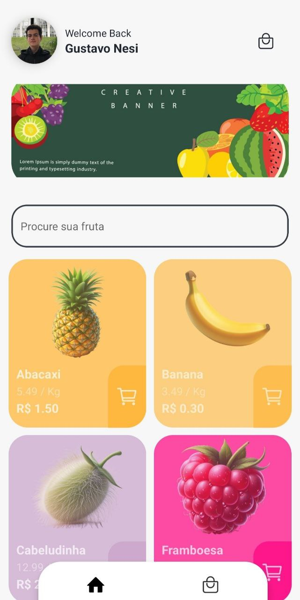

# MarketFruit


**MarketFruit** é um aplicativo móvel para visualizar e comprar frutas do mercado. Desenvolvido com Expo e React Native, utiliza Firebase para autenticação e armazenamento de dados, e Styled Components para estilização.

## Funcionalidades

### Tela de Login
<p aling="center">
   
</p>


- **Navegar pelas frutas**: Veja uma lista de frutas disponíveis.
<p aling="center">
   
</p>

- **Detalhes da fruta**: Visualize informações sobre cada fruta.
<p aling="center">
   
</p>

- **Adicionar ao carrinho**: Selecione frutas para comprar.
<p aling="center">
   
</p>


## Tecnologias Utilizadas

- **Expo**: Para desenvolvimento de aplicações React Native.
- **React Native**: Biblioteca para criar aplicativos móveis.
- **Firebase**: Para autenticação e armazenamento de dados.
- **Styled Components**: Para estilização dos componentes.

## Instalação

1. **Clone o repositório**

   ```bash
   git clone https://github.com/GustavoNesi/Fruit-app-Mobile.git
